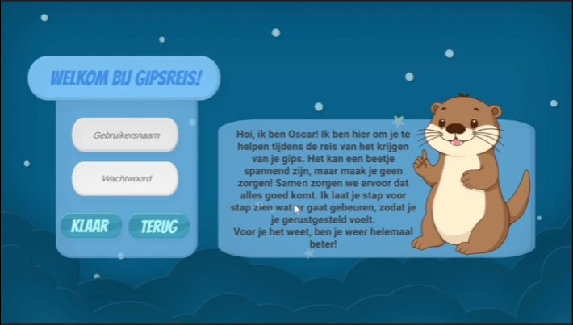
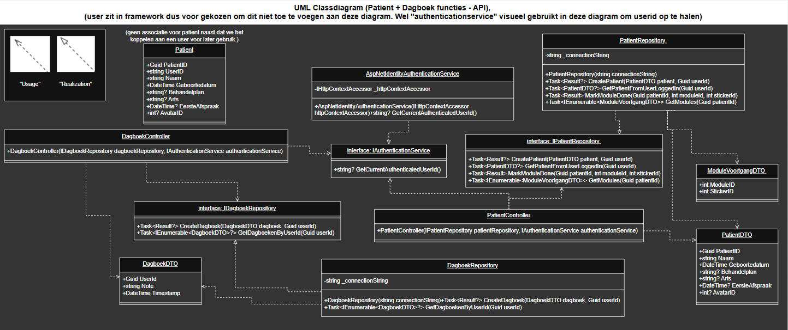

# Avans HBO Jaar 1, Periode 3: ATIx ICT-B1.3 2D-Graphics and Secure-Communication LU1(2024-25)
- (12-03-2025 / 04-04-2025)
- C#, Azure, Unity, Postman, MSTests

## Project Overview
Dit is het derde project van onze Informatica-opleiding. Het project bestaat uit een individueel en een groepsdeel. Dit is het groepsdeel(LU1).
- **Unity gedeelte(frontend)**, folder: `LU1-Unity`
- **API gedeelte(backend)**, folder: `LU1-WebApi`
- **MSTests(testen)**, folder: `LU1-WebApi.Tests`(overige tests staan in `Assets/Tests`, bijvoorbeeld postman tests.)

Er waren verschillende casussen om uit te kiezen, en in dit project hebben we gekozen voor de casus "Gips-behandeling".

Preview:

- [Behandeltraject-Gips](Assets/Opdracht/ICT-B1.3-LU1-Behandeltraject-Gips.pdf)
- [Gebruikersscenario](Assets/Opdracht/ICT-B1.3-LU1-Behandeltraject-Gips.pdf)
- [Projectomschrijving](Assets/Opdracht/ICT-B1.3-LU1-Behandeltraject-Gips.pdf)
- ["Voorbeeld-script"](Assets/DB/ZorgApp(school-geleverd).sql)

## Beveiliging
Voor beveliging in deze opdracht hebben we precies dezelfde maatregelen en technieken gebruikt als in de LU2 opdracht. [(Mijn LU-2)](https://github.com/Koen-Smit/ATIx1.3_2D-Graphics-Secure-Communication-LU2)

## Applicatiestructuur/Functionaliteit/Demo

### Frontend(Unity):
Er zijn verschillende scenes waar de gebruiker naar toe kan:
- Het aanmeld scherm met een login/register panel.
- Gegevens scherm waar de gebruiker gegevens kan invoeren, een route en een avatar kan kiezen.
- 2 verschillende "traject" schermen, na er een gekozen te hebben kom je op dit scherm, hier is ook een menu knop.
- Dagboeknotitie scherm waar je notities en eventueel afspraken kan bijhouden als gebruiker.
- Alle module-schermen waar de gebruiker naartoe kan via het "traject" scherm.

**Aanmeld scherm**
- Bij alle schermen waar je niet ingelogd bent, word je automatisch teruggestuurd naar het login scherm.
- Hier kun je inloggen of registreren. De naam moet uniek zijn en het wachtwoord moet voldoen aan bepaalde eisen.

**Gegevens scherm**
- Hier kan de gebruiker gegevens invoeren, trajecten kiezen en een avatar selecteren. Alleen bij geldige invoer (zoals een correcte datum en geen lege velden) kan de gebruiker verder.

**Traject-scherm**
- Het trajectscherm bevat een functie waarbij stickers komen op module-knoppen die afgerond zijn. dit word afgehandeld via de API en een module is "Klaar" wanneer er op de klaar druk gedrukt word.

**Dagboeknotitie**
- In dit scherm krijg je de keuze uit 2 mogelijke filter opties. "Notities", "Afspraken". Alles komt in notities, behalve alle notities die "@afspraak" bevatten! (Dit hebben we toegevoegd door feedback van de product-owner)

---

### Backend(C# API):
De API deployed automatisch naar Azure als de unit-tests slagen. (/via github-actions)

Lokaal gebruiken we SwaggerUI om de functionaliteiten van de API helder en overzichtelijk weer te geven. Voor deze opdracht hebben we alleen de noodzakelijke API-calls gemaakt.
- **Code voor de api staat in de folder: `/LU1-WebApi`**

Classdiagram voor de api:

---

### Tests(MSTests & Postman):
We hebben veel testen gemaakt en gedaan, deze zijn allemaal terug te vinden in: `/Assets/Tests`(postman tests, user acceptance tests en testrapportage/plan) en `/LU1-WebApi.Tests`(unittests). 

- [Testplan/rapportage](Assets/Tests/Testplan.pdf)
- [Postman-script](Assets/Tests/Postman/LU1-WebApi.postman_collection.json)
- [Run-collection-resultaten](Assets/Tests/Postman/LU1-WebApi.postman_test_run.json)

---

